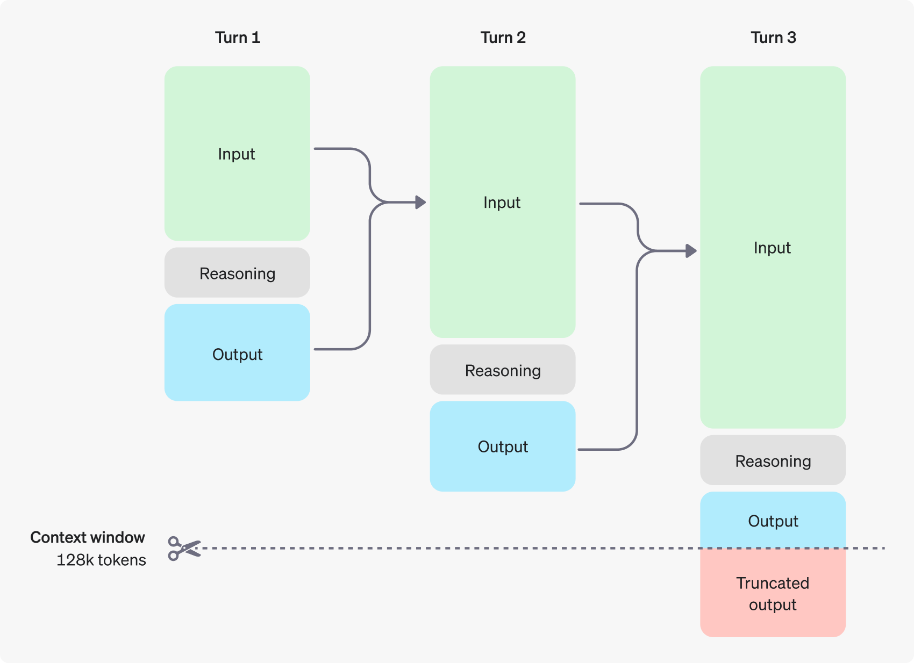

## o1 Model Prompting

A breakdown of the prompting techniques and considerations for the OpenAI o1 series models, aiming for a recipe that blends clarity and effectiveness.

The o1 series models represent a significant leap in reasoning capabilities, offering powerful potential for complex tasks. By understanding the principles of prompt design, context window management, and the nuances of reasoning tokens, you can unlock the full potential of these models and create innovative applications that leverage their advanced reasoning abilities. 

**Modelling:**

1. **Model Selection:** 
    * `o1-preview`: For complex reasoning tasks involving broad general knowledge.
    * `o1-mini`: For faster and cheaper solutions, especially for coding, math, and science problems.

2. **Prompt Design:**
    * **Simplicity is Key:**  Direct, clear instructions with minimal fluff. Avoid complex prompt engineering techniques like few-shot prompting or "think step by step" instructions.
    * **Delimiters for Clarity:** Use visual cues (triple quotes, XML tags, section titles) to separate distinct parts of your input.
    * **Focused Context:**  In RAG scenarios, provide only the most relevant information to prevent overcomplication.

3. **Context Window Management:**
    * **Token Awareness:**  Remember that both reasoning tokens (invisible) and completion tokens (visible) consume space in the context window.
    * **Reserved Space:**  Allocate at least 25,000 tokens for reasoning and outputs, adjusting as needed based on your prompt's complexity.
    * **`max_completion_tokens`:**  Use this parameter to explicitly control the total number of tokens generated (reasoning + completion), preventing unexpected cost increases.

4. **Prompt Examples:**

   * **Refactoring Code:**
     ```python
     from openai import OpenAI

     client = OpenAI()

     prompt = """
     Instructions:
     - Given the React component below, change it so that nonfiction books have red
       text. 
     - Return only the code in your reply
     - Do not include any additional formatting, such as markdown code blocks
     - For formatting, use four space tabs, and do not allow any lines of code to 
       exceed 80 columns

     const books = [
       { title: 'Dune', category: 'fiction', id: 1 },
       { title: 'Frankenstein', category: 'fiction', id: 2 },
       { title: 'Moneyball', category: 'nonfiction', id: 3 },
     ];

     export default function BookList() {
       const listItems = books.map(book =>
         <li>
           {book.title}
         </li>
       );

       return (
         <ul>{listItems}</ul>
       );
     }
     """

     response = client.chat.completions.create(
         model="o1-mini",
         messages=[
             {
                 "role": "user",
                 "content": [
                     {
                         "type": "text",
                         "text": prompt
                     },
                 ],
             }
         ]
     )

     print(response.choices[0].message.content)
     ```

   * **Data Validation:**
     ```
     Prompt: "Evaluate this synthetic medical data set for discrepancies.  The data includes patient demographics, diagnoses, and treatment records.  Highlight any inconsistencies or anomalies."
     ```

   * **Routine Generation:**
     ```
     Prompt: "Using the following help center article, generate a list of actions that a customer support agent could perform to resolve a common issue: [Article Title].  Include specific steps and any relevant information."
     ```

**Blueprint for Reasoning:**

* **Context Window:** 128,000 tokens
* **Maximum Output Tokens:**
    * `o1-preview`: Up to 32,768 tokens
    * `o1-mini`: Up to 65,536 tokens
* **Reasoning Token Cost:**  Reasoning tokens are billed as output tokens, even though they are not visible in the API response.
* **`max_completion_tokens`:**  Use this parameter to control the total number of tokens generated (reasoning + completion).

**Breakdown of the reasoning process:**

In essence, the o1 models think before they answer, using reasoning tokens to perform complex internal calculations and deductions before producing a visible response.



Here's a breakdown of how reasoning works in OpenAI's o1 series models, presented in a step-by-step format:

* **Prompt Reception:** The model receives your prompt, which can be a question, a task, or a complex request.
* **Reasoning Token Generation:** The o1 model begins generating internal "reasoning tokens." These tokens represent the model's internal thought process, breaking down the prompt into smaller steps and exploring different approaches to solve the problem.
* **Multi-Step Reasoning:** The model uses these reasoning tokens to engage in a chain of thought, considering multiple perspectives, exploring different strategies, and potentially even performing calculations or logical deductions.
* **Reasoning Token Discard:**  After the reasoning process is complete, the model discards the reasoning tokens. These tokens are not visible in the API response.
* **Completion Token Generation:** The model then generates "completion tokens" that form the visible response to your prompt. This response is the result of the model's reasoning process.
* **Output Delivery:** The completion tokens are delivered to you as the model's answer, reflecting the outcome of the reasoning process.

**Key Points:**

* **Invisible Reasoning:**  The reasoning tokens are internal to the model and not visible in the API response.
* **Token Consumption:**  Reasoning tokens consume space in the model's context window and are billed as output tokens.
* **Enhanced Accuracy:** The reasoning process allows the o1 models to achieve higher accuracy on complex tasks, especially those involving logic, mathematics, and scientific reasoning.

**Example:**

Imagine you ask the o1 model: "What is the area of a triangle with a base of 10 cm and a height of 5 cm?"

* **Reasoning Tokens:** The model might generate reasoning tokens representing steps like:
    * "Area of a triangle = (1/2) * base * height"
    * "Base = 10 cm"
    * "Height = 5 cm"
    * "Area = (1/2) * 10 cm * 5 cm"
* **Completion Tokens:** The model would then generate completion tokens to provide the answer: "The area of the triangle is 25 square centimeters."


